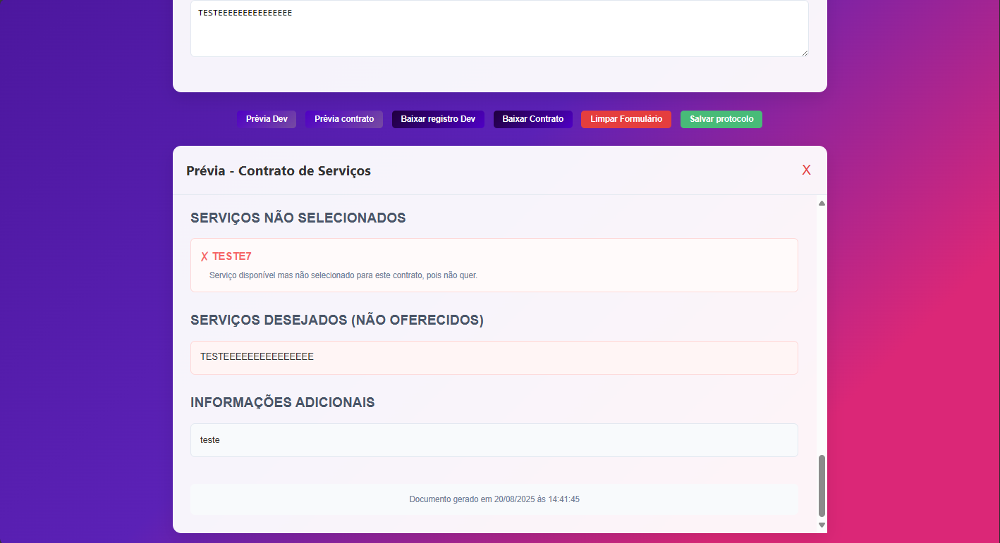

# 📄 Sistema de Documentação de Serviços para ERPs

Este projeto é uma aplicação web que permite **documentar e configurar serviços por ERP**, gerar **pré-visualizações** e **baixar em PDF** as informações configuradas.  
Foi desenvolvido para facilitar o registro e controle de serviços disponíveis para diferentes **Sistemas ERPs**.

---


## 🚀 Funcionalidades

- 📌 **Seleção de ERP**: escolha entre ERPs pré-definidos ou crie novos.
- ⚙️ **Configuração de serviços**: adicione, edite e configure cada serviço.
- 🛡️ **Proteção de serviços padrão**: serviços que vêm pré-configurados não podem ser excluídos.
- ➕ **Criação de novos serviços** por ERP.
- 👁️ **Pré-visualização** de documento (modo desenvolvedor e cliente).
- 📄 **Geração de PDF** estilizado com as informações preenchidas.
- 💾 **Persistência no navegador** via `localStorage`.
- ✅ **Validação de campos obrigatórios** antes de gerar prévias ou PDFs.

---

## 🗂️ Estrutura do Projeto

/
├── index.html # Estrutura HTML principal
├── style.css # Estilos visuais
├── script.js # Lógica de interação e controle
├── README.md # Documentação do projeto
└── /assets # (opcional) imagens e ícones

yaml
Copiar
Editar

---

## ⚙️ Tecnologias Utilizadas

- **HTML5** – Estrutura da página
- **CSS3** – Estilização visual
- **JavaScript (Vanilla)** – Lógica da aplicação
- **html2pdf.js** – Geração de PDFs
- **localStorage** – Persistência de dados no navegador

---

## 📥 Instalação e Uso

1. **Clone este repositório** ou baixe os arquivos:
   ```bash
   git clone https://github.com/seu-usuario/seu-repo.git
Abra o index.html diretamente no navegador.
(Não é necessário servidor local para rodar, pois o projeto é 100% client-side.)

Selecione ou adicione um ERP.

Configure os serviços ou adicione novos.

Preencha os campos obrigatórios (ex.: Nome do Contratante, Quem está documentando, etc.).

Clique em:

"Prévia Registro Dev" para visualizar documento com detalhes técnicos.

"Prévia Lista Serviços" para visualizar lista de serviços.

"Baixar PDF" para exportar.

🛠️ Personalização
Para adicionar novos ERPs padrão ou serviços padrão, edite a variável erpData no script.js.

Para mudar estilos, altere o style.css.

Para mudar textos e rótulos, edite diretamente no HTML ou no JavaScript.

📌 Regras de Exclusão
ERPs padrão (ex.: IXC, SGP) não podem ser excluídos.

Serviços padrão também não podem ser excluídos — apenas novos serviços criados pelo usuário.

Ao tentar excluir um serviço protegido, o sistema exibe aviso.

🐞 Possíveis Problemas e Soluções
PDF em branco:

Verifique se o elemento a ser capturado não está display:none.

Aguarde carregamento completo de imagens e fontes antes de gerar.

Botões executando submit:

Certifique-se de que todos os botões que não enviam formulário tenham type="button".

Perda de dados ao mudar de ERP:

Os dados são salvos no localStorage. Se o navegador limpar cache/localStorage, as configurações serão perdidas.

📄 Licença
Este projeto é de uso interno. Não há licença pública atribuída.